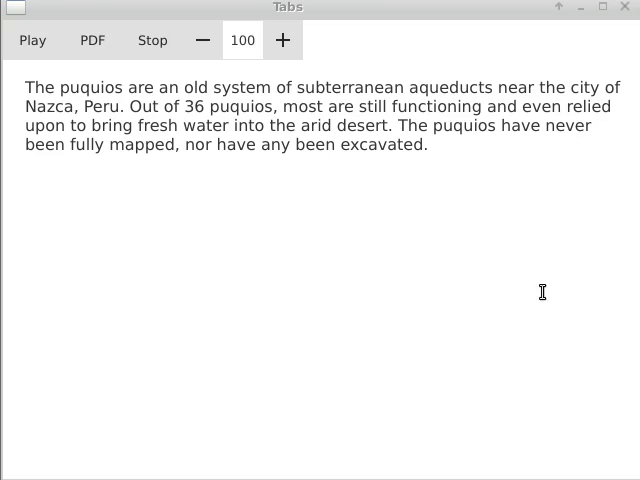

# TTS
A self contained PDF - Text To Speech application for Linux desktop and Android. No runtime dependency on the host system libraries required  (Google TTS, PDF). The library does depend on two key third-party libraries:
- PDF-Writer - https://github.com/galkahana/PDF-Writer
- libcerevoice - https://www.cereproc.com/en/products/sdk
- QtQuick with 3rd party library wrappers

[](https://kubaroth.github.io/tts/images/demo.mp4)

# Dependencies
Qt5.14 - As long as QtQuick is compatible with some version Android API
- recommended Android API 21 or higer (Android 5.0)
- tested with Qt5.14 NDK 21.0 Android API 29

NOTE: see below to see detailed steps to set up all dependencies

# Build dependencies - pdf parser (PDF-Writer)

Update paths to NDK, Android and Qt in:
- build_pdf_hummus_parser.sh
- build_android_package.sh

This will build two sets of libraries for Linux desktop and Android
```
git submodule update --init
./build_pdf_hummus_parser.sh
```

# Build Android apk package and deploy to a phone
(may require checking your device ID with adb (if multiple are connected)
If the phone is connected this should sideload the package
```
./build_android_package.sh
```

# Build Linux desktop package

```
mkdir -p __build_linux && cd __build_linux
$HOME/toolchains/Qt5.14.0/5.14.0/gcc_64/bin/qmake ../tts_android.pro -spec linux-g++ CONFIG+=debug CONFIG+=qml_debug
make -j 4
```

# Steps to install all dependencies

```
wget https://download.qt.io/archive/qt/5.14/5.14.2/qt-opensource-linux-x64-5.14.2.run
wget https://redirector.gvt1.com/edgedl/android/studio/ide-zips/3.5.2.0/android-studio-ide-191.5977832-linux.tar.gz
wget https://dl.google.com/android/repository/android-ndk-r21b-linux-x86_64.zip
```
- Download Android SDK with Android Studio
```
tar -xv android-studio-ide-191.5977832-linux.tar.gz
cd /tmp/android-studio/bin/
chmod 777 studio.sh
./studio.sh
```
### Download necessary components:
- Android SDK
- Android SDK Platform API 29 Android 10 (Q)

to: $HOME/Android/Sdk

Extract NDK
```
unzip android-ndk-r21b-linux-x86_64.zip -d $HOME/Android/
```
### Install Qt (inlcluding Gcc and Android toolchains)

### Extract proprietary dependencies for this repository
This shold create/update following directories:
- libs
- libs_android
- file_data (with voice data)
```
7z x tts_android.7z.001
```


### Update paths to Andoid SDK and NDK

Update paths to NDK, Android and Qt in:
- build_pdf_hummus_parser.sh
- build_android_package.sh


# TODO:
- update license
- ability to load external pdfs

